# Diagrama de Clases - Backend Evaluaciones 360

```mermaid
classDiagram
    class Config {
        -DB_USER: str
        -DB_PASSWORD: str
        -DB_HOST: str
        -DB_PORT: int
        -DB_NAME: str
        -SQLALCHEMY_DATABASE_URI: str
        +__init__()
    }

    class Evaluaciones {
        -id: String(50) [PK]
        -id_consecutivo: Integer [NOT NULL]
        -nombre: String(140)
        -instrucciones: Text
        -nombre_formulario: String(200)
        -fecha_insercion: DateTime [NOT NULL, DEFAULT=UTC_NOW]
        -esta_eliminada: Boolean [NOT NULL, DEFAULT=False]
        +__init__(id, id_consecutivo, nombre, instrucciones, nombre_formulario, fecha_insercion, esta_eliminada)
        +__repr__(): str
    }

    class EvaluacionesSchema {
        <<Marshmallow Schema>>
        +Meta: class
        +model: Evaluaciones
        +include_relationships: bool
        +load_instance: bool
    }

    class EvaluacionesView {
        <<Flask-RESTful Resource>>
        +post(): tuple[dict, int]
        +get(): tuple[list, int]
    }

    class EvaluacionDetailView {
        <<Flask-RESTful Resource>>
        +put(id: str): tuple[dict, int]
        +delete(id: str): tuple[dict, int]
    }

    class HealthCheckView {
        <<Flask-RESTful Resource>>
        +get(): tuple[str, int]
    }

    class ResetDatabaseView {
        <<Flask-RESTful Resource>>
        +post(): tuple[dict, int]
    }

    class Flask_App {
        <<Flask Application>>
        -app: Flask
        -api: Api
        +config: Config
        +run()
    }

    class SQLAlchemy_DB {
        <<Database Instance>>
        +Model: class
        +Column: function
        +String: function
        +Integer: function
        +Text: function
        +DateTime: function
        +Boolean: function
        +session: Session
        +init_app(app: Flask)
        +create_all()
    }

    %% Utility Functions
    class UtilityFunctions {
        <<Static Functions>>
        +existe_evaluacion(nombre: str): bool
    }

    %% Schema Instances
    class SchemaInstances {
        <<Module Level>>
        +evaluacion_schema: EvaluacionesSchema
        +evaluaciones_schema: EvaluacionesSchema
    }

    %% Relationships
    Flask_App --> Config : uses
    Flask_App --> SQLAlchemy_DB : initializes
    Flask_App --> EvaluacionesView : registers
    Flask_App --> EvaluacionDetailView : registers
    Flask_App --> HealthCheckView : registers
    Flask_App --> ResetDatabaseView : registers
    
    Evaluaciones --> SQLAlchemy_DB : inherits from db.Model
    EvaluacionesSchema --> Evaluaciones : serializes
    
    EvaluacionesView --> Evaluaciones : creates/queries
    EvaluacionesView --> SQLAlchemy_DB : uses session
    EvaluacionesView --> EvaluacionesSchema : uses for serialization
    EvaluacionesView --> UtilityFunctions : uses existe_evaluacion()
    
    EvaluacionDetailView --> Evaluaciones : queries/updates
    EvaluacionDetailView --> SQLAlchemy_DB : uses session
    
    ResetDatabaseView --> Evaluaciones : deletes all
    ResetDatabaseView --> SQLAlchemy_DB : uses session
    
    SchemaInstances --> EvaluacionesSchema : instantiates
    UtilityFunctions --> Evaluaciones : queries
    UtilityFunctions --> SQLAlchemy_DB : uses session

    %% Notes
    note for Evaluaciones "Modelo principal que representa\nuna evaluación 360.\nUsa UUID como clave primaria\ny soft delete con esta_eliminada"
    
    note for EvaluacionesView "Endpoint: /evaluaciones\nPOST: Crear nueva evaluación\nGET: Listar evaluaciones activas"
    
    note for EvaluacionDetailView "Endpoint: /evaluaciones/<id>\nPUT: Actualizar evaluación\nDELETE: Eliminación lógica"
    
    note for HealthCheckView "Endpoint: /evaluaciones/ping\nHealth check del servicio"
    
    note for ResetDatabaseView "Endpoint: /evaluaciones/reset\nLimpia toda la base de datos"
```

## Descripción de las Clases

### 1. **Config**
- **Responsabilidad**: Manejo de configuración de la aplicación
- **Características**: 
  - Obtiene variables de entorno para conexión a PostgreSQL
  - Construye la URI de conexión a la base de datos
  - Proporciona valores por defecto

### 2. **Evaluaciones** (Modelo de Datos)
- **Responsabilidad**: Representar una evaluación 360 en la base de datos
- **Características**:
  - Usa UUID como clave primaria
  - Implementa soft delete con `esta_eliminada`
  - Manejo automático de fecha de inserción con timezone UTC
  - ID consecutivo para referencias más amigables

### 3. **EvaluacionesSchema** (Serialización)
- **Responsabilidad**: Serialización/deserialización del modelo Evaluaciones
- **Características**:
  - Basado en Marshmallow-SQLAlchemy
  - Conversión automática entre JSON y modelo de datos

### 4. **Vistas REST (Flask-RESTful Resources)**

#### **EvaluacionesView**
- **Endpoints**: `/evaluaciones`
- **Métodos**: 
  - `POST`: Crear nueva evaluación con validaciones
  - `GET`: Listar evaluaciones activas (no eliminadas)

#### **EvaluacionDetailView**
- **Endpoints**: `/evaluaciones/<id>`
- **Métodos**: 
  - `PUT`: Actualizar evaluación existente
  - `DELETE`: Eliminación lógica (soft delete)

#### **HealthCheckView**
- **Endpoints**: `/evaluaciones/ping`
- **Métodos**: `GET` para verificar estado del servicio

#### **ResetDatabaseView**
- **Endpoints**: `/evaluaciones/reset`
- **Métodos**: `POST` para limpiar base de datos (útil para testing)

### 5. **Flask_App** (Aplicación Principal)
- **Responsabilidad**: Configuración y inicialización de la aplicación
- **Características**:
  - Integración con Flask-RESTful
  - Configuración de base de datos
  - Registro de rutas y recursos

### 6. **Funciones Utilitarias**
- **existe_evaluacion()**: Verifica duplicados por nombre antes de crear

## Patrones de Diseño Identificados

1. **Repository Pattern**: Las vistas actúan como repositorios para el modelo Evaluaciones
2. **DTO Pattern**: EvaluacionesSchema actúa como Data Transfer Object
3. **Soft Delete Pattern**: Eliminación lógica en lugar de física
4. **Configuration Pattern**: Centralización de configuración en clase Config
5. **RESTful API Pattern**: Implementación de API REST con recursos bien definidos

## Arquitectura

- **Patrón**: MVC (Model-View-Controller) adaptado para API REST
- **Framework**: Flask con Flask-RESTful
- **ORM**: SQLAlchemy con Flask-SQLAlchemy
- **Serialización**: Marshmallow
- **Base de Datos**: PostgreSQL
